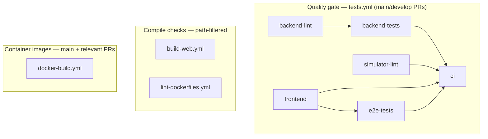

# GitHub Actions

## Workflow map



## When each workflow runs

| Workflow | Trigger | Purpose |
|----------|---------|---------|
| `tests.yml` | Push/PR to `main` or `develop`, manual dispatch | Primary quality gate: lint, unit/integration tests, E2E |
| `build-web.yml` | Push/PR when `web/**` changes | Next.js production build on Node 22 |
| `lint-dockerfiles.yml` | Push/PR when Dockerfiles change | Hadolint |
| `docker-build.yml` | Push to `main`; PR when app/Docker paths change | Build and push GHCR images |

## `tests.yml` job graph

Lint and frontend checks start immediately in parallel:

- `backend-lint` → `backend-tests` (Python 3.11 / 3.12 / 3.13)
- `simulator-lint`
- `frontend` (ESLint, typecheck, translation keys, Vitest)

`e2e-tests` depends only on `frontend`, not on the backend test matrix. E2E boots its own backend and most data-loading specs mock GraphQL anyway, so waiting for three Python versions added minutes without improving signal.

`ci` is the single aggregation job for branch protection. It succeeds only when `backend-tests`, `simulator-lint`, `frontend`, and `e2e-tests` all pass.

Re-run the full suite manually:

```bash
gh workflow run tests.yml
```

## Running locally with act

```bash
# List jobs
act -l -W .github/workflows/tests.yml

# Run the full quality gate
act -W .github/workflows/tests.yml

# Run one job
act -W .github/workflows/tests.yml -j frontend
act -W .github/workflows/tests.yml -j e2e-tests
```

Prerequisites: Docker running, [act](https://github.com/nektos/act) installed.

E2E and service-backed jobs need a medium or large act image. Service containers (Postgres, Redis) are started automatically.

## Removed workflows

These duplicated `tests.yml` and ran the same checks twice on every PR:

- `e2e-tests.yml`
- `backend-tests.yml`
- `frontend-tests.yml`
- `lint-python.yml` (flake8; the repo uses ruff in `tests.yml`)
- `build-docker-*.yml` (four files → `docker-build.yml` matrix)
