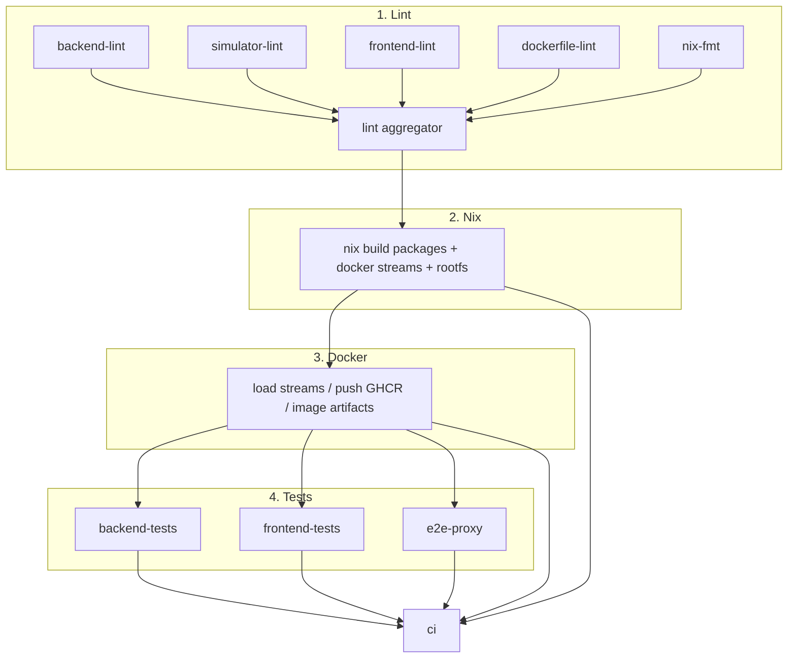

# GitHub Actions

## Pipeline order


```mermaid
flowchart TD
  subgraph lint["1. Lint"]
    BL[backend-lint]
    SL[simulator-lint]
    FE[frontend-lint]
    DL[dockerfile-lint]
    NF[nix-fmt]
    L[lint aggregator]
    BL --> L
    SL --> L
    FE --> L
    DL --> L
    NF --> L
  end

  subgraph nix["2. Nix"]
    N[nix build packages + docker streams + rootfs]
  end

  subgraph docker["3. Docker"]
    D[load streams / push GHCR / image artifacts]
  end

  subgraph tests["4. Tests"]
    BT[backend-tests]
    FT[frontend-tests]
    EP[e2e-proxy]
  end

  L --> N --> D
  D --> BT
  D --> FT
  D --> EP
  BT --> CI[ci]
  FT --> CI
  EP --> CI
  N --> CI
  D --> CI
```

## Workflow

| Workflow | Trigger | Purpose |
|----------|---------|---------|
| `tests.yml` | Push/PR to `main` or `develop`, manual dispatch | Full gate: lint → nix → docker → tests |

Images are Nix `streamLayeredImage` scratch builds. E2E runs only against the proxied docker-compose stack.

## Local act

```bash
act -l -W .github/workflows/tests.yml
act -W .github/workflows/tests.yml -j nix
```
