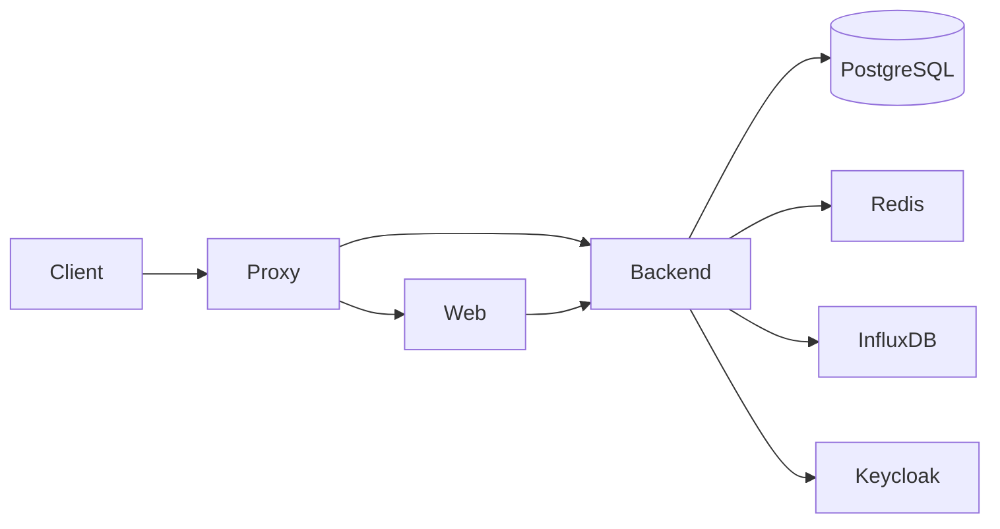

# Project overview

**helpwave tasks** is a task and ward-management platform for healthcare. It brings structure to clinical workflows: patients, tasks, locations, and custom properties.

## What it does

- **Patients**: Admit, discharge, wait, mark deceased; attach to locations (clinic, ward, room, bed) and teams.
- **Tasks**: Create, assign (user or team), complete, reopen; filter by location and assignee.
- **Locations**: Hierarchy (hospital → clinic → ward → room → bed) and teams; access control is location-based.
- **Properties**: Custom field definitions for patients and tasks (text, number, date, select, user, etc.).
- **Audit**: Activity logged to InfluxDB for compliance and debugging.

## Main components

| Component | Role |
|-----------|------|
| **backend** | Python (FastAPI + Strawberry GraphQL), PostgreSQL, Redis, InfluxDB. Auth via Keycloak. |
| **web** | Next.js (React), Apollo Client, GraphQL. PWA-ready. |
| **simulator** | Scripts to simulate clinic traffic (patients, tasks) for development. |
| **proxy** | Nginx reverse proxy for production (TLS, routing). |
| **keycloak** | Realm and client config for SSO. |

## High-level architecture

- **Web** serves the UI and talks to the backend GraphQL API (HTTP + WebSocket for subscriptions).
- **Backend** resolves queries/mutations/subscriptions, enforces location-based access, and publishes entity events to Redis for real-time updates.
- **Keycloak** issues JWT; the backend validates tokens and passes user/locations into resolvers.
